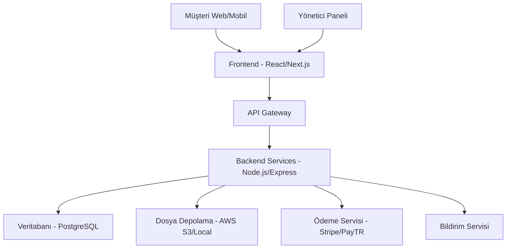

# Tasarım Belgesi

## Genel Bakış

Elmalı Market E-ticaret Platformu, müşteri odaklı yaklaşımla tasarlanmış, kişiselleştirme ve sosyal kanıt özelliklerine sahip modern bir online alışveriş sistemidir. Platform, referans sitelerden (Özdilek Teyim, CarrefourSA, Çağrı Market, Tahtakale Spot) ilham alarak özgün bir tasarım sunacak ve hızlı checkout, akıllı kampanya yönetimi ve gerçek zamanlı sipariş takibi gibi gelişmiş özellikler içerecektir.

## Mimari

### Sistem Mimarisi



### Teknoloji Yığını

**Frontend:**
- React.js + Next.js (SSR/SSG desteği için)
- Tailwind CSS (responsive tasarım)
- TypeScript (tip güvenliği)
- React Query (veri yönetimi)

**Backend:**
- Node.js + Express.js
- TypeScript
- JWT (kimlik doğrulama)
- Multer (dosya yükleme)

**Veritabanı:**
- PostgreSQL (ana veritabanı)
- Redis (önbellek ve oturum yönetimi)

**Dış Servisler:**
- Stripe veya PayTR (ödeme işlemleri)
- Nodemailer (e-posta bildirimleri)
- AWS S3 veya yerel depolama (ürün görselleri)

## Bileşenler ve Arayüzler

### Frontend Bileşenleri

#### 1. Müşteri Arayüzü

**Ana Sayfa:**
- Hero section (kampanya banner'ları ile)
- Kişiselleştirilmiş "Size Özel" ürün önerileri
- Kategori grid (görsel odaklı, CarrefourSA tarzı)
- Öne çıkan ürünler carousel
- Müşteri memnuniyet göstergeleri
- E-posta listesi kayıt formu

**Ürün Listesi:**
- Akıllı filtreleme (fiyat, marka, özellikler)
- Çoklu sıralama seçenekleri
- Infinite scroll veya sayfalama
- "Son 24 saatte X kişi satın aldı" sosyal kanıt
- Hızlı sepete ekleme butonları

**Ürün Detayı:**
- Yüksek kaliteli görsel galeri (zoom özelliği)
- Detaylı ürün açıklaması ve özellikler
- Müşteri yorumları ve puanlamaları
- "Benzer Ürünler" önerisi
- Stok durumu ve teslimat bilgisi
- Sosyal paylaşım butonları

**Sepet:**
- Mini sepet dropdown (header'da)
- Detaylı sepet sayfası
- Kupon kodu uygulama alanı
- Ücretsiz kargo eşik göstergesi
- Tamamlayıcı ürün önerileri
- Hızlı checkout butonu

**Tek Sayfa Checkout:**
- Misafir checkout seçeneği
- Otomatik adres doldurma
- Gerçek zamanlı form validasyonu
- Çoklu ödeme seçenekleri
- Güvenlik sertifikaları gösterimi
- Sipariş özeti sidebar

**Hesabım:**
- Dashboard (sipariş durumu, öneriler)
- Sipariş geçmişi ve takip
- Adres defteri yönetimi
- Favori ürünler
- Bildirim tercihleri
- Puan ve yorum yönetimi

#### 2. Yönetici Paneli

**Dashboard:**
- Gerçek zamanlı satış istatistikleri
- Son siparişler ve durum güncellemeleri
- Stok uyarıları ve kritik seviyeler
- Müşteri memnuniyet metrikleri
- Kampanya performans göstergeleri

**Ürün Yönetimi:**
- Toplu ürün yükleme (Excel/CSV)
- Görsel yönetimi (çoklu upload, optimize)
- Kategori hiyerarşisi yönetimi
- Fiyat ve stok toplu güncelleme
- SEO optimizasyon araçları

**Sipariş Yönetimi:**
- Gerçek zamanlı sipariş bildirimleri
- Sipariş durumu toplu güncelleme
- Kargo entegrasyonu ve takip
- İade ve değişim yönetimi
- Müşteri iletişim araçları

**Kampanya Yönetimi:**
- Dinamik kampanya oluşturma
- Kupon kodu üretme ve yönetimi
- A/B test araçları
- Kampanya performans analizi
- Otomatik pazarlama kuralları

**Müşteri Yönetimi:**
- Müşteri segmentasyonu
- Satın alma davranış analizi
- Yorum ve değerlendirme moderasyonu
- Müşteri destek ticket sistemi
- Sadakat programı yönetimi

**Raporlar ve Analitik:**
- Satış performans raporları
- Ürün analiz raporları
- Müşteri davranış analizi
- Kampanya ROI raporları
- Stok hareket raporları

### API Arayüzleri

#### 1. Ürün API'leri
```typescript
GET /api/products - Ürün listesi
GET /api/products/:id - Ürün detayı
POST /api/products - Yeni ürün (admin)
PUT /api/products/:id - Ürün güncelleme (admin)
DELETE /api/products/:id - Ürün silme (admin)
GET /api/categories - Kategori listesi
```

#### 2. Sepet API'leri
```typescript
GET /api/cart - Sepet içeriği
POST /api/cart/add - Sepete ürün ekleme
PUT /api/cart/update - Sepet güncelleme
DELETE /api/cart/remove - Sepetten ürün çıkarma
```

#### 3. Sipariş API'leri
```typescript
POST /api/orders - Sipariş oluşturma
GET /api/orders - Sipariş listesi
GET /api/orders/:id - Sipariş detayı
PUT /api/orders/:id/status - Sipariş durumu güncelleme (admin)
```

#### 4. Kimlik Doğrulama API'leri
```typescript
POST /api/auth/login - Giriş yapma
POST /api/auth/register - Kayıt olma
POST /api/auth/logout - Çıkış yapma
GET /api/auth/profile - Profil bilgileri
```

#### 5. Yorum ve Değerlendirme API'leri
```typescript
GET /api/reviews/product/:productId - Ürün yorumları
POST /api/reviews - Yorum ekleme
PUT /api/reviews/:id - Yorum güncelleme
DELETE /api/reviews/:id - Yorum silme
PUT /api/reviews/:id/approve - Yorum onaylama (admin)
```

#### 6. Kampanya ve Kupon API'leri
```typescript
GET /api/campaigns - Aktif kampanyalar
GET /api/campaigns/:id - Kampanya detayı
POST /api/campaigns - Kampanya oluşturma (admin)
POST /api/coupons/validate - Kupon doğrulama
POST /api/coupons/apply - Kupon uygulama
```

#### 7. Kişiselleştirme API'leri
```typescript
GET /api/recommendations - Kişiselleştirilmiş öneriler
GET /api/recommendations/similar/:productId - Benzer ürünler
POST /api/user/preferences - Kullanıcı tercihlerini güncelleme
GET /api/user/viewed-products - Görüntülenen ürünler
```

#### 8. Bildirim API'leri
```typescript
POST /api/notifications/order-status - Sipariş durumu bildirimi
POST /api/notifications/email-subscribe - E-posta listesi kayıt
GET /api/notifications/user/:userId - Kullanıcı bildirimleri
```

## Veri Modelleri

### 1. Kullanıcı (User)
```typescript
interface User {
  id: string;
  email: string;
  password: string; // hashed
  firstName: string;
  lastName: string;
  phone?: string;
  role: 'customer' | 'admin';
  addresses: Address[];
  createdAt: Date;
  updatedAt: Date;
}
```

### 2. Ürün (Product)
```typescript
interface Product {
  id: string;
  name: string;
  description: string;
  price: number;
  discountPrice?: number;
  stock: number;
  categoryId: string;
  images: string[];
  isActive: boolean;
  createdAt: Date;
  updatedAt: Date;
}
```

### 3. Kategori (Category)
```typescript
interface Category {
  id: string;
  name: string;
  description?: string;
  parentId?: string;
  isActive: boolean;
  createdAt: Date;
  updatedAt: Date;
}
```

### 4. Sipariş (Order)
```typescript
interface Order {
  id: string;
  userId: string;
  items: OrderItem[];
  totalAmount: number;
  status: 'pending' | 'confirmed' | 'preparing' | 'shipped' | 'delivered' | 'cancelled';
  shippingAddress: Address;
  paymentMethod: string;
  paymentStatus: 'pending' | 'paid' | 'failed';
  createdAt: Date;
  updatedAt: Date;
}
```

### 5. Sepet (Cart)
```typescript
interface Cart {
  id: string;
  userId?: string; // null for guest users
  sessionId?: string; // for guest users
  items: CartItem[];
  createdAt: Date;
  updatedAt: Date;
}
```

### 6. Yorum ve Değerlendirme (Review)
```typescript
interface Review {
  id: string;
  userId: string;
  productId: string;
  rating: number; // 1-5
  comment: string;
  isVerifiedPurchase: boolean;
  isApproved: boolean;
  createdAt: Date;
  updatedAt: Date;
}
```

### 7. Kampanya (Campaign)
```typescript
interface Campaign {
  id: string;
  name: string;
  description: string;
  type: 'discount' | 'free_shipping' | 'buy_x_get_y';
  value: number;
  minOrderAmount?: number;
  startDate: Date;
  endDate: Date;
  isActive: boolean;
  usageLimit?: number;
  usageCount: number;
  createdAt: Date;
  updatedAt: Date;
}
```

### 8. Kupon (Coupon)
```typescript
interface Coupon {
  id: string;
  code: string;
  campaignId: string;
  userId?: string; // null for public coupons
  isUsed: boolean;
  usedAt?: Date;
  createdAt: Date;
  expiresAt: Date;
}
```

### 9. Kullanıcı Tercihleri (UserPreferences)
```typescript
interface UserPreferences {
  id: string;
  userId: string;
  favoriteCategories: string[];
  viewedProducts: string[];
  searchHistory: string[];
  emailNotifications: boolean;
  smsNotifications: boolean;
  createdAt: Date;
  updatedAt: Date;
}
```

## Hata Yönetimi

### 1. Frontend Hata Yönetimi
- **Global Error Boundary**: React uygulamasında beklenmeyen hataları yakalama
- **API Hata Yönetimi**: HTTP status kodlarına göre kullanıcı dostu mesajlar
- **Form Validasyonu**: Gerçek zamanlı form doğrulama ve hata gösterimi
- **Loading States**: Yükleme durumları ve skeleton ekranlar

### 2. Backend Hata Yönetimi
- **Global Error Handler**: Express middleware ile merkezi hata yönetimi
- **Validation Errors**: Joi veya Yup ile veri doğrulama hataları
- **Database Errors**: PostgreSQL hata kodlarının kullanıcı dostu mesajlara çevrilmesi
- **Authentication Errors**: JWT ve kimlik doğrulama hatalarının yönetimi

### 3. Hata Kodları
```typescript
enum ErrorCodes {
  VALIDATION_ERROR = 'VALIDATION_ERROR',
  UNAUTHORIZED = 'UNAUTHORIZED',
  FORBIDDEN = 'FORBIDDEN',
  NOT_FOUND = 'NOT_FOUND',
  INTERNAL_SERVER_ERROR = 'INTERNAL_SERVER_ERROR',
  PAYMENT_FAILED = 'PAYMENT_FAILED',
  INSUFFICIENT_STOCK = 'INSUFFICIENT_STOCK'
}
```

## Test Stratejisi

### 1. Frontend Testleri
- **Unit Tests**: Jest + React Testing Library ile bileşen testleri
- **Integration Tests**: API entegrasyonu testleri
- **E2E Tests**: Cypress ile kullanıcı senaryoları
- **Visual Regression Tests**: Storybook + Chromatic

### 2. Backend Testleri
- **Unit Tests**: Jest ile servis ve utility fonksiyon testleri
- **Integration Tests**: Supertest ile API endpoint testleri
- **Database Tests**: Test veritabanı ile CRUD işlem testleri
- **Authentication Tests**: JWT ve güvenlik testleri

### 3. Test Kapsamı
- **Kritik İş Akışları**: Sipariş verme, ödeme, ürün yönetimi
- **Güvenlik Testleri**: SQL injection, XSS, CSRF koruması
- **Performance Tests**: Yük testleri ve response time ölçümleri
- **Mobile Tests**: Responsive tasarım ve dokunmatik etkileşimler

### 4. Test Ortamları
- **Development**: Yerel geliştirme ortamı
- **Staging**: Üretim benzeri test ortamı
- **Production**: Canlı ortam (monitoring ile)

## Güvenlik Önlemleri

### 1. Kimlik Doğrulama ve Yetkilendirme
- JWT token tabanlı kimlik doğrulama
- Refresh token mekanizması
- Role-based access control (RBAC)
- Rate limiting (brute force koruması)

### 2. Veri Güvenliği
- Şifre hashleme (bcrypt)
- SQL injection koruması (parameterized queries)
- XSS koruması (input sanitization)
- CSRF token koruması

### 3. Ödeme Güvenliği
- PCI DSS uyumlu ödeme sağlayıcısı
- SSL/TLS şifreleme
- Kart bilgilerinin saklanmaması
- 3D Secure desteği

## UI/UX Tasarım Prensipleri

### 1. Müşteri Odaklı Tasarım
**Referans Sitelerden İlham:**
- **Özdilek Teyim Market**: Temiz kategori navigasyonu ve ürün gösterimi
- **CarrefourSA**: Güçlü arama ve filtreleme deneyimi
- **Çağrı Market**: Yerel market hissi ve güven unsurları
- **Tahtakale Spot**: Kampanya ve fırsat vurgusu

**Elmalı Market Özgün Kimliği:**
- Yeşil-turuncu renk paleti (elma teması)
- Sıcak ve samimi ton of voice
- Yerel değerleri yansıtan görseller
- Aile işletmesi güven unsurları

### 2. Kullanıcı Deneyimi Öncelikleri
- **Hız**: 3 saniye altında sayfa yükleme
- **Sezgisel Navigasyon**: Maksimum 3 tık ile ürüne ulaşım
- **Mobil First**: Önce mobil, sonra desktop tasarım
- **Erişilebilirlik**: WCAG 2.1 AA standartları
- **Kişiselleştirme**: Her kullanıcıya özel deneyim

### 3. Görsel Tasarım Sistemi
**Renk Paleti:**
- Primary: #2D5A27 (Koyu Yeşil)
- Secondary: #FF8C42 (Turuncu)
- Accent: #F4F4F4 (Açık Gri)
- Success: #4CAF50 (Yeşil)
- Warning: #FF9800 (Sarı)
- Error: #F44336 (Kırmızı)

**Tipografi:**
- Başlıklar: Inter (Bold, Semi-bold)
- Gövde metni: Inter (Regular, Medium)
- Fiyatlar: Inter (Bold)

**İkonografi:**
- Outline style ikonlar
- 24px standart boyut
- Tutarlı stroke width (2px)

### 4. Responsive Breakpoints
- Mobile: 320px - 768px
- Tablet: 768px - 1024px
- Desktop: 1024px - 1440px
- Large Desktop: 1440px+

## Performans Optimizasyonları

### 1. Frontend Optimizasyonları
- Code splitting ve lazy loading
- Image optimization (WebP, AVIF desteği)
- CDN kullanımı (Cloudflare)
- Service Worker ile offline destek
- Critical CSS inlining
- Font optimization (font-display: swap)

### 2. Backend Optimizasyonları
- Database indexing (PostgreSQL)
- Redis ile multi-layer caching
- API response compression (gzip)
- Connection pooling
- Query optimization
- Background job processing

### 3. Mobil Optimizasyonları
- Progressive Web App (PWA) özellikleri
- Touch-friendly UI elements (44px minimum)
- Fast loading (< 3 saniye)
- Offline functionality
- App-like navigation
- Push notification desteği

### 4. SEO Optimizasyonları
- Server-side rendering (Next.js)
- Structured data markup
- Meta tag optimization
- Sitemap generation
- Image alt text optimization
- Page speed optimization
#
# Kişiselleştirme Algoritması

### 1. Veri Toplama
**Kullanıcı Davranışları:**
- Görüntülenen ürünler ve süre
- Sepete eklenen ürünler
- Satın alınan ürünler
- Arama sorguları
- Kategori tercihleri
- Tıklama heatmap'i

**Demografik Veriler:**
- Yaş grubu (opsiyonel)
- Cinsiyet (opsiyonel)
- Konum bilgisi
- Alışveriş saatleri
- Cihaz tercihi (mobil/desktop)

### 2. Öneri Algoritmaları
**Collaborative Filtering:**
- Benzer kullanıcıların satın aldığı ürünler
- "Bu ürünü alanlar şunları da aldı"
- Kullanıcı benzerlik matrisi

**Content-Based Filtering:**
- Ürün özelliklerine dayalı öneriler
- Kategori bazlı öneriler
- Marka tercihi analizi

**Hybrid Approach:**
- Collaborative + Content-based kombinasyonu
- Machine learning ile ağırlık optimizasyonu
- A/B test ile algoritma iyileştirme

### 3. Gerçek Zamanlı Kişiselleştirme
- Session bazlı öneriler
- Sepet analizi ile tamamlayıcı ürünler
- Dinamik fiyat gösterimi
- Kişiselleştirilmiş kampanyalar

## Sosyal Kanıt Stratejisi

### 1. Güven Göstergeleri
**Satış İstatistikleri:**
- "Son 24 saatte X kişi satın aldı"
- "Bu ay en çok satılan ürün"
- "Stokta sadece X adet kaldı"
- "X kişi sepetine ekledi"

**Müşteri Yorumları:**
- 5 yıldız puanlama sistemi
- Doğrulanmış alım yorumları
- Fotoğraflı yorumlar
- Yorum faydalılık oylama

**Güvenlik Sertifikaları:**
- SSL sertifikası gösterimi
- Güvenli ödeme logoları
- İade garantisi vurgusu
- Müşteri hizmetleri iletişim

### 2. Sosyal Medya Entegrasyonu
- Instagram ürün etiketleme
- Facebook pixel entegrasyonu
- WhatsApp destek hattı
- Sosyal paylaşım butonları

## Kampanya Yönetim Sistemi

### 1. Kampanya Türleri
**İndirim Kampanyaları:**
- Yüzde bazlı indirimler
- Sabit tutar indirimleri
- Kategori bazlı indirimler
- Marka bazlı indirimler

**Kargo Kampanyaları:**
- Ücretsiz kargo eşikleri
- Hızlı teslimat kampanyaları
- Belirli bölgelere özel kampanyalar

**Kombo Kampanyaları:**
- "2 al 1 öde" kampanyaları
- "X TL üzeri Y hediye" kampanyaları
- Sepet bazlı hediye ürünler

### 2. Dinamik Kampanya Motoru
- Stok durumuna göre otomatik kampanya
- Sezon bazlı kampanya aktivasyonu
- Kullanıcı segmentine özel kampanyalar
- Gerçek zamanlı kampanya performans takibi

### 3. Kupon Sistemi
- Tek kullanımlık kuponlar
- Çoklu kullanım kuponları
- Kullanıcı özel kuponlar
- Referans kuponları

## Bildirim Sistemi

### 1. E-posta Bildirimleri
**Transactional E-postalar:**
- Sipariş onayı
- Kargo bilgilendirme
- Teslimat onayı
- İade/değişim durumu

**Marketing E-postalar:**
- Haftalık kampanya bülteni
- Kişiselleştirilmiş ürün önerileri
- Sepet terk etme hatırlatması
- Doğum günü kampanyaları

### 2. SMS Bildirimleri
- Sipariş durumu güncellemeleri
- Kargo takip bilgileri
- Acil kampanya duyuruları
- OTP doğrulama kodları

### 3. Push Bildirimleri (PWA)
- Gerçek zamanlı kampanya bildirimleri
- Stok geri geldi bildirimleri
- Fiyat düşüşü uyarıları
- Kişiselleştirilmiş öneriler

## Güvenlik Mimarisi

### 1. Veri Güvenliği
**Kişisel Veri Koruma:**
- GDPR uyumluluğu
- Veri şifreleme (AES-256)
- Veri minimizasyonu
- Kullanıcı onay yönetimi

**Ödeme Güvenliği:**
- PCI DSS Level 1 uyumluluk
- Tokenization sistemi
- 3D Secure v2 desteği
- Fraud detection algoritmaları

### 2. Sistem Güvenliği
**API Güvenliği:**
- Rate limiting
- JWT token expiration
- API key management
- Request validation

**Infrastructure Güvenliği:**
- WAF (Web Application Firewall)
- DDoS koruması
- SSL/TLS 1.3
- Security headers

## Monitoring ve Analytics

### 1. Performance Monitoring
- Real User Monitoring (RUM)
- Core Web Vitals takibi
- API response time monitoring
- Database query performance

### 2. Business Analytics
- Conversion funnel analizi
- Customer lifetime value
- Churn rate analizi
- Product performance metrics

### 3. Error Tracking
- Frontend error monitoring
- Backend exception tracking
- User session replay
- Performance bottleneck detection