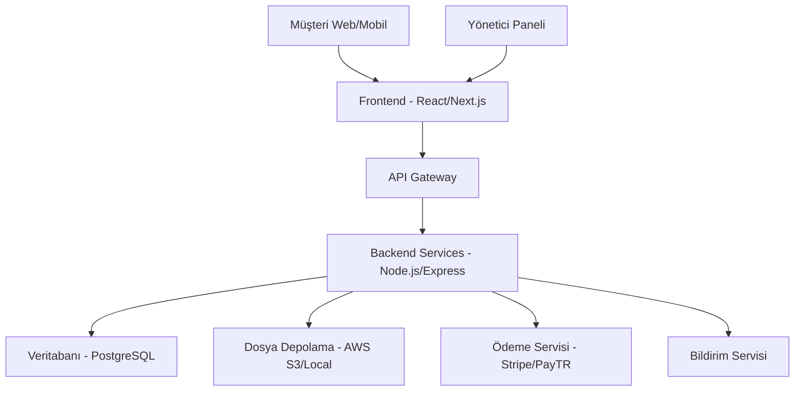

# Tasarım Belgesi

## Genel Bakış

Elmalı Market E-ticaret Platformu, modern web teknolojileri kullanarak geliştirilecek, tam responsive bir online alışveriş sistemidir. Platform, müşteri arayüzü (frontend), yönetim paneli (admin) ve API servisleri (backend) olmak üzere üç ana bileşenden oluşacaktır.

## Mimari

### Sistem Mimarisi



### Teknoloji Yığını

**Frontend:**
- React.js + Next.js (SSR/SSG desteği için)
- Tailwind CSS (responsive tasarım)
- TypeScript (tip güvenliği)
- React Query (veri yönetimi)

**Backend:**
- Node.js + Express.js
- TypeScript
- JWT (kimlik doğrulama)
- Multer (dosya yükleme)

**Veritabanı:**
- PostgreSQL (ana veritabanı)
- Redis (önbellek ve oturum yönetimi)

**Dış Servisler:**
- Stripe veya PayTR (ödeme işlemleri)
- Nodemailer (e-posta bildirimleri)
- AWS S3 veya yerel depolama (ürün görselleri)

## Bileşenler ve Arayüzler

### Frontend Bileşenleri

#### 1. Müşteri Arayüzü
- **Ana Sayfa**: Hero section, öne çıkan ürünler, kategoriler
- **Ürün Listesi**: Filtreleme, sıralama, sayfalama
- **Ürün Detayı**: Görsel galeri, açıklama, sepete ekleme
- **Sepet**: Ürün listesi, miktar güncelleme, toplam hesaplama
- **Ödeme**: Müşteri bilgileri, teslimat adresi, ödeme formu
- **Hesabım**: Sipariş geçmişi, profil yönetimi

#### 2. Yönetici Paneli
- **Dashboard**: Satış istatistikleri, son siparişler
- **Ürün Yönetimi**: CRUD işlemleri, kategori yönetimi
- **Sipariş Yönetimi**: Sipariş listesi, durum güncelleme
- **Müşteri Yönetimi**: Müşteri listesi ve detayları
- **Raporlar**: Satış raporları, stok raporları

### API Arayüzleri

#### 1. Ürün API'leri
```typescript
GET /api/products - Ürün listesi
GET /api/products/:id - Ürün detayı
POST /api/products - Yeni ürün (admin)
PUT /api/products/:id - Ürün güncelleme (admin)
DELETE /api/products/:id - Ürün silme (admin)
GET /api/categories - Kategori listesi
```

#### 2. Sepet API'leri
```typescript
GET /api/cart - Sepet içeriği
POST /api/cart/add - Sepete ürün ekleme
PUT /api/cart/update - Sepet güncelleme
DELETE /api/cart/remove - Sepetten ürün çıkarma
```

#### 3. Sipariş API'leri
```typescript
POST /api/orders - Sipariş oluşturma
GET /api/orders - Sipariş listesi
GET /api/orders/:id - Sipariş detayı
PUT /api/orders/:id/status - Sipariş durumu güncelleme (admin)
```

#### 4. Kimlik Doğrulama API'leri
```typescript
POST /api/auth/login - Giriş yapma
POST /api/auth/register - Kayıt olma
POST /api/auth/logout - Çıkış yapma
GET /api/auth/profile - Profil bilgileri
```

## Veri Modelleri

### 1. Kullanıcı (User)
```typescript
interface User {
  id: string;
  email: string;
  password: string; // hashed
  firstName: string;
  lastName: string;
  phone?: string;
  role: 'customer' | 'admin';
  addresses: Address[];
  createdAt: Date;
  updatedAt: Date;
}
```

### 2. Ürün (Product)
```typescript
interface Product {
  id: string;
  name: string;
  description: string;
  price: number;
  discountPrice?: number;
  stock: number;
  categoryId: string;
  images: string[];
  isActive: boolean;
  createdAt: Date;
  updatedAt: Date;
}
```

### 3. Kategori (Category)
```typescript
interface Category {
  id: string;
  name: string;
  description?: string;
  parentId?: string;
  isActive: boolean;
  createdAt: Date;
  updatedAt: Date;
}
```

### 4. Sipariş (Order)
```typescript
interface Order {
  id: string;
  userId: string;
  items: OrderItem[];
  totalAmount: number;
  status: 'pending' | 'confirmed' | 'preparing' | 'shipped' | 'delivered' | 'cancelled';
  shippingAddress: Address;
  paymentMethod: string;
  paymentStatus: 'pending' | 'paid' | 'failed';
  createdAt: Date;
  updatedAt: Date;
}
```

### 5. Sepet (Cart)
```typescript
interface Cart {
  id: string;
  userId?: string; // null for guest users
  sessionId?: string; // for guest users
  items: CartItem[];
  createdAt: Date;
  updatedAt: Date;
}
```

## Hata Yönetimi

### 1. Frontend Hata Yönetimi
- **Global Error Boundary**: React uygulamasında beklenmeyen hataları yakalama
- **API Hata Yönetimi**: HTTP status kodlarına göre kullanıcı dostu mesajlar
- **Form Validasyonu**: Gerçek zamanlı form doğrulama ve hata gösterimi
- **Loading States**: Yükleme durumları ve skeleton ekranlar

### 2. Backend Hata Yönetimi
- **Global Error Handler**: Express middleware ile merkezi hata yönetimi
- **Validation Errors**: Joi veya Yup ile veri doğrulama hataları
- **Database Errors**: PostgreSQL hata kodlarının kullanıcı dostu mesajlara çevrilmesi
- **Authentication Errors**: JWT ve kimlik doğrulama hatalarının yönetimi

### 3. Hata Kodları
```typescript
enum ErrorCodes {
  VALIDATION_ERROR = 'VALIDATION_ERROR',
  UNAUTHORIZED = 'UNAUTHORIZED',
  FORBIDDEN = 'FORBIDDEN',
  NOT_FOUND = 'NOT_FOUND',
  INTERNAL_SERVER_ERROR = 'INTERNAL_SERVER_ERROR',
  PAYMENT_FAILED = 'PAYMENT_FAILED',
  INSUFFICIENT_STOCK = 'INSUFFICIENT_STOCK'
}
```

## Test Stratejisi

### 1. Frontend Testleri
- **Unit Tests**: Jest + React Testing Library ile bileşen testleri
- **Integration Tests**: API entegrasyonu testleri
- **E2E Tests**: Cypress ile kullanıcı senaryoları
- **Visual Regression Tests**: Storybook + Chromatic

### 2. Backend Testleri
- **Unit Tests**: Jest ile servis ve utility fonksiyon testleri
- **Integration Tests**: Supertest ile API endpoint testleri
- **Database Tests**: Test veritabanı ile CRUD işlem testleri
- **Authentication Tests**: JWT ve güvenlik testleri

### 3. Test Kapsamı
- **Kritik İş Akışları**: Sipariş verme, ödeme, ürün yönetimi
- **Güvenlik Testleri**: SQL injection, XSS, CSRF koruması
- **Performance Tests**: Yük testleri ve response time ölçümleri
- **Mobile Tests**: Responsive tasarım ve dokunmatik etkileşimler

### 4. Test Ortamları
- **Development**: Yerel geliştirme ortamı
- **Staging**: Üretim benzeri test ortamı
- **Production**: Canlı ortam (monitoring ile)

## Güvenlik Önlemleri

### 1. Kimlik Doğrulama ve Yetkilendirme
- JWT token tabanlı kimlik doğrulama
- Refresh token mekanizması
- Role-based access control (RBAC)
- Rate limiting (brute force koruması)

### 2. Veri Güvenliği
- Şifre hashleme (bcrypt)
- SQL injection koruması (parameterized queries)
- XSS koruması (input sanitization)
- CSRF token koruması

### 3. Ödeme Güvenliği
- PCI DSS uyumlu ödeme sağlayıcısı
- SSL/TLS şifreleme
- Kart bilgilerinin saklanmaması
- 3D Secure desteği

## Performans Optimizasyonları

### 1. Frontend Optimizasyonları
- Code splitting ve lazy loading
- Image optimization ve WebP desteği
- CDN kullanımı
- Service Worker ile offline destek

### 2. Backend Optimizasyonları
- Database indexing
- Redis ile caching
- API response compression
- Connection pooling

### 3. Mobil Optimizasyonları
- Progressive Web App (PWA) özellikleri
- Touch-friendly UI elements
- Fast loading (< 3 saniye)
- Offline functionality